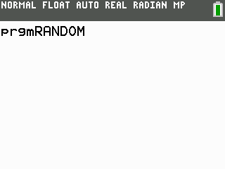

# TI-Basic Random Number Guesser by veevyo

Thank you to andrewk on the /r/calculators Discord server for helping me remember how End works!

# About
This is a random number guesser written in TI-Basic. It utilizes randInt to generate
a random number between 1 and 9. The program keeps the random number as a constant, 
and it also tells the player whether their guess was too high or too low compared to the constant,
so they can use strategy to figure out what the number is. There is also a counter, which informs
the player how many moves it took them to guess the number. 

# How to play

There are two modes: Arcade and Endless.

Arcade: In this mode, you only have 3 moves. If you cannot guess the number in 3 moves, you lose.

Endless: In this mode, you have infinite moves. At the end, the amount of moves you used is displayed.

To use the program, upload it to your calculator using TI-Connect, or emulate it using something
like Wabbitemu, using a legally dumped ROM. If you use a TI-84 Plus C Silver Edition or a TI-84 Plus
CE, use RANDOM.8xp. Otherwise, use RANDBW.8xp. 

This game is compatible with the following calculators: 
1. TI-83 Plus
2. TI-84 Plus
3. TI-84 Plus Silver Edition
4. TI-84 Plus C Silver Edition
5. TI-84 Plus CE
